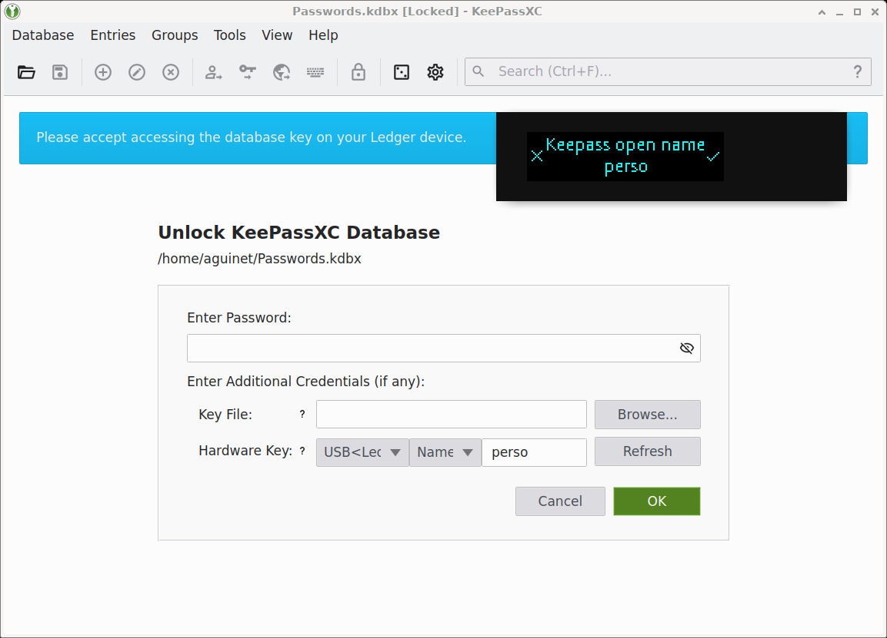
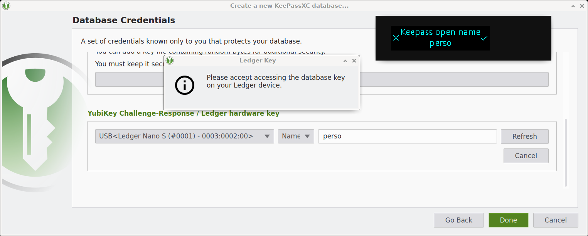

# LedgerKeePass application


This repository contains the code to an Ledger BOLOS application to derive
and/or store encryption keys for KeePass databases.

**WARNING: Please do not use this in production yet. See the Status section below.**

The userland part has been implemented in a [fork of
KeePassXC](https://github.com/aguinet/keepassxc/tree/feature/ledger). It uses
the provided ``libkpl`` library, to talk with the Ledger application.  The goal
is to have this merged in the official [KeePassXC][kpxc] application when the
Ledger application will be considered stable (see
[PR](https://github.com/keepassxreboot/keepassxc/pull/5842)).

We also provide a [KeePass2][kp2] plugin (see below).

This application supports Ledger Nano S and X devices. Blue isn't supported.

## Status

**WARNING: Please do not use this in production yet. Databases could be lost
or corrupted, and/or secrets leaked. You have been warned.** This section explains why.

The 0.2.0 version of the Ledger application has been submitted to Ledger for
[approval](https://ledger.readthedocs.io/en/latest/additional/publishing_an_app.html).
This review might involve some changes that could modify the way keys are
derived from database names. If such changes need to occur, that would mean
that databases previously encrypted could be lost.

We are thus waiting for this review to release the final 1.0.0 that would be
considered stable and production ready. In the meantime, use this at your own
risk.

## Screenshots

The app in action, running in Speculos!

### KeePassXC

While opening a database:



Database creation:



### KeePass2 plugin


## Build & install

### KeePass2 plugin

You can use pre-built packages for
[Windows](https://github.com/aguinet/LedgerKeePass/releases/download/0.2.0/KeePass2.47-plugin-x64-windows.zip)
&
[Linux](https://github.com/aguinet/LedgerKeePass/releases/download/0.2.0/KeePass2.47-plugin-x64-ubuntu16.04.zip)
x64.

To install the plugin, extract the content of ths archives directly into `/path/to/KeePass2/Plugins`. For instance:

* on Linux, it can be in `/usr/lib/keepass2/Plugins`
* on Windows, default installation is in `C:\Program Files (x86)\KeePass Password Safe 2\Plugins`

On Linux, `libhidapi-libusb0` is needed. On Debian-like system, you can install it with:

```
sudo apt install libhidapi-libusb0
```

### Ledger application

You first need to install the [BOLOS
SDK](https://ledger.readthedocs.io/en/latest/userspace/getting_started.html).
You especially need to setup the ``BOLOS_SDK`` environment variable to the
directory where you extracted the SDK, and get a working Clang cross compiler.

Once this is setup, just run ``make`` in the ``app`` directory. Application
binaries will be in the ``app/bin`` directory.

### KPL (KeePassLedger) userland library

Dependencies:

* [cmake](https://cmake.org/)
* [libsodium][sodium]
* [hidapi](https://github.com/signal11/hidapi)

[libsodium][sodium] has been choosen for the userland cryptographic operations,
because [KeePassXC][kpxc] already links with it (no extra dependency involved).

#### Linux/OSX

On Debian-based systems, you can install the dependencies like this:

```
$ sudo apt install libsodium-dev libhidapi-dev cmake
```

On OSX, with [MacPorts](https://www.macports.org/):

```
$ sudo port install cmake hidapi libsodium
```

To build the library:

```
cd libkpl && mkdir build && cd build
cmake -DCMAKE_BUILD_TYPE=Release ..
make
cmake -DCMAKE_INSTALL_PREFIX=/path/to/prefix -P cmake_install.cmake
```

This will install ``libkpl`` into the prefix of your choice. This prefix will
be useful to compile the [KeePassXC
fork](https://github.com/aguinet/keepassxc/tree/feature/ledger).

#### Windows

One way to do it is to use vcpkg to gather dependencies, and CMake to build the
project. It has been tested with Visual Studio 2019's compiler.

First, [install vcpkg](https://github.com/microsoft/vcpkg#quick-start-windows).
Then, in a Visual Studio 2019 x64 command prompt:

```
> \path\to\vcpkg\vcpkg install libsodium hidapi --triplet x64-windows
> cd \path\to\ledger-keepass\libkpl
> mkdir build
> cd build
> cmake -DCMAKE_TOOLCHAIN_FILE=/path/to/vcpkg/scripts/buildsystems/vcpkg.cmake ..
> cmake --build . --config release
```

### KeePassXC fork

Please refer to [KeePassXC build
instructions](https://github.com/keepassxreboot/keepassxc/blob/develop/INSTALL.md).
The only things that changes is when running ``cmake``: you need to enable the
Ledger plugin, and provide the path to ``libkpl`` cmake files:

```
$ cmake -DWITH_XC_LEDGER=ON -Dkpl_DIR=/path/to/kpl_prefix/lib/cmake [other parameters]
```

## Usage

The app is capable of providing keys to [KeePassXC][kpxc] / [KeePass2][kp2] in two ways:

* by deriving a 32 bytes key using the device's seed and a user provided string
  (e.g. `perso`)
* by giving user-provided 32 bytes keys stored on the device. The app is
  capable of storing 8 differents keys.

User interaction is needed before a key is sent to the KeePassXC application.

The KeePassXC GUI can't yet store user-provided keys. The ``kpl_set`` tool compiled
alongside the ``kpl`` library can do this.

## Run with the Speculos emulator

[Build and
install](https://github.com/LedgerHQ/speculos/blob/master/doc/build.md) the
[Speculos][speculos] emulator. 

Once the Ledger application is compiled, you can run it with [Speculos][speculos]:

```
/path/to/speculos.py app/bin/app.elf -k 1.6
```

You can the emulated application with [KeePassXC][kpxc] / [KeePass2][kp2] by setting these environment variables:

```
export LEDGER_PROXY_ADDRESS=127.0.0.1
export LEDGER_PROXY_PORT=9999
```

(By default, Speculos listens on TCP port 9999).

## Protocol

See [protocol.md](protocol.md).

## Tests

Tests needs Python 3 to run, with some packages:

```
pip install -r tests/requirements.txt
```

Tests will use the tools build with `libkpl` to test this library. You thus
need to specify a `libkpl` build directory to the tests, with the path to the
Speculos main script:

```
tests/run.sh /path/to/speculos.py /path/to/libkpl/build nanos
```

This will test the application with a pure Python implementation of ``libkpl``,
and then ``libkpl`` itself.

It also specifies that the application has been compiled for the ``nanos``
model. To test the ``nanox`` version, replace ``nanos`` by ``nanox`` in the
``run.sh`` command line.


## TODO

* KeePassXC GUI for key slots
* test on actual devices!


[speculos]: https://github.com/LedgerHQ/speculos/
[kpxc]: https://github.com/keepassxreboot/keepassxc/
[sodium]: https://github.com/jedisct1/libsodium
[kp2]: https://keepass.info/
